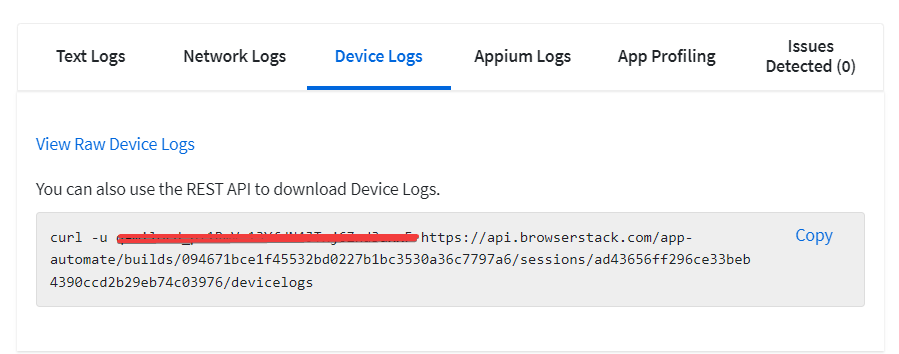
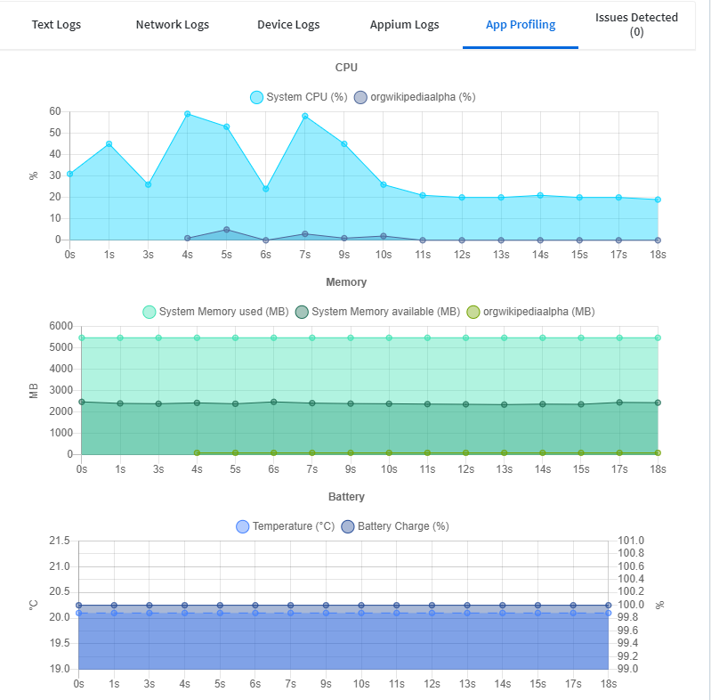

# Проект по автоматизации тестирования 
## <a target="_blank" href="https://github.com/wikimedia/apps-android-wikipedia/releases/download/latest/app-alpha-universal-release.apk">мобильного приложения Wikipedia</a>


## :rocket: Содержание:

- [x] <a href="#rocket-технологии-и-инструменты">Технологии и инструменты</a>
- [x] <a href="#rocket-реализованные-проверки">Реализованные проверки</a>
- [x] <a href="#rocket-сборка-в-Jenkins">Сборка в Jenkins</a>
- [x] <a href="#rocket-запуск-из-терминала">Запуск из терминала</a>
- [x] <a href="#rocket-allure-отчет">Allure отчет</a>
- [x] <a href="#rocket-Результаты-тестов-в-BrowserStack">Результаты тестов в BrowserStack</a>
- [x] <a href="#rocket-видео-примеры-прохождения-тестов">Видео примеры прохождения тестов</a>

## :rocket: Технологии и инструменты
<p align="center">


</p>

## :rocket: Реализованные проверки

- Переход на каждую из основных страниц приложения
- Работоспособность системы поиска
- Наличие основных элементов в результате поиска

## :rocket: Сборка в Jenkins
### <a target="_blank" href="https://jenkins.autotests.cloud/job/Lesson_20_mobile_tests_part2/">Сборка в Jenkins</a>
<p align="center">

</p>

### Параметры сборки в Jenkins:
Сборка в Jenkins

- устройство, по умолчанию Pixel 4 API 30
- версия ОС, по умолчанию Android 11.0

## :rocket: Запуск из терминала
Локальный запуск:
```
gradle clean screen -Dhost=(browserStack/realDevice/androidEmulator)
```

Удаленный запуск:
```
clean
screen
"-Dhost=${HOST}"
```

## :rocket: Allure отчет
- ### Главный экран отчета
<p align="center">

</p>

- ### Страница с проведенными тестами
<p align="center">

</p>

## :rocket: Результаты тестов в BrowserStack
- ### Экран с результатами запуска тестов
<p align="center">

</p>

- ### Вкладка с текстовыми логами в BrowserStack
<p align="center">


</p>

- ### Вкладка с логами устройства в BrowserStack
<p align="center">

</p>
# curl -u login:password https://api.browserstack.com/app-automate/builds/094671bce1f45532bd0227b1bc3530a36c7797a6/sessions/ad43656ff296ce33beb4390ccd2b29eb74c03976/devicelogs

- ### Вкладка с логами appium в BrowserStack
<p align="center">

</p>
# curl -u login:password https://api.browserstack.com/app-automate/builds/094671bce1f45532bd0227b1bc3530a36c7797a6/sessions/ad43656ff296ce33beb4390ccd2b29eb74c03976/appiumlogs

- ### Вкладка состояния устройства в BrowserStack
<p align="center">

</p>

## :rocket: Видео примеры прохождения тестов
> К каждому тесту в отчете прилагается видео. Одно из таких видео представлено ниже.
<p align="center">
  
</p>


